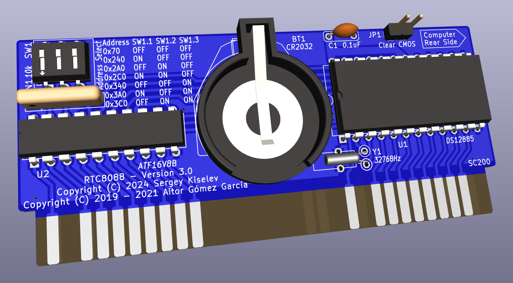

# RTC8088
Real Time Clock for your PC XT. Very low profile, simple and open hardware.

## Hardware Documentation

### Schematic and PCB Layout

[Schematic - Version 3.0](KiCad/RTC8088-Schematic-3.0.pdf)

[PCB Layout - Version 3.0](KiCad/RTC8088-Board-3.0.pdf)

### Swiches and Jumpers

#### SW1 - RTC I/O address select

I/O Address  | SW1.1 | SW 1.2 | SW 1.3
------------ | ----- | ------ | ------
0x70         | OFF   | OFF    | OFF
0x240        | ON    | OFF    | OFF
0x2A0        | OFF   | ON     | OFF
0x2C0        | ON    | ON     | OFF
0x340        | OFF   | OFF    | ON
0x3A0        | ON    | OFF    | ON
0x3C0        | OFF   | ON     | ON
Reserved     | ON    | ON     | ON

* Note 1: The table above gives the addresses in the supplied SPLD fuse map. The selection can be changed by reprogramming the SPLD
* Note 2: "Reserved" address is set to 0x70 in the supplied SPLD fuse map. It is recommended to use this setting when adding a custom I/O address to the SPLD

#### JP1 - Clear CMOS

Position       | Description
-------------- | -----------------
open (default) | Normal operation
closed         | Clear NVRAM memory

### Bill of Materials

#### Version 3.0

[RTC8088 project on Mouser.com](https://www.mouser.com/ProjectManager/ProjectDetail.aspx?AccessID=2877d21cfa) - View and order all components except of the FDC and the PCB.

[RTC8088 on OSH Park](https://oshpark.com/shared_projects/bAF8uwKL) - View and order the PCB.

Component type     | Reference | Description                                     | Quantity | Possible sources and notes 
------------------ | --------- | ----------------------------------------------- | -------- | --------------------------
PCB                |           | RTC8088 PCB - Version 3.0                       | 1        | Order from your favorite PCB manufacturer using provided Gerber files
Integrated Circuit | U1        | DS12885+ - RTC, 24 pin DIP                      | 1        | Mouser [700-DS12885](https://www.mouser.com/ProductDetail/700-DS12885) or [700-DS12885N](https://www.mouser.com/ProductDetail/700-DS12885N)
Integrated Circuit | U2        | ATF16V8B-15PU - Simple Programmable Logic Device, 20 pin DIP | 1 | Mouser [556-AF16V8B15PU](https://www.mouser.com/ProductDetail/556-AF16V8B15PU) or GAL16V8
Quartz Crystal     | Y1        | 32768 Hz, 6 pF                                  | 1        | Mouser [815-AB26T32768KHZ6B](https://www.mouser.com/ProductDetail/815-AB26T32768KHZ6B), [520-ECS327-6-13-X](https://www.mouser.com/ProductDetail/520-ECS327-6-13-X), or [628-VT200F-6PF20PPM](https://www.mouser.com/ProductDetail/628-VT200F-6PF20PPM)
Battery Holder     | BT1       | CR2032 battery holder                           | 1        | Mouser [122-2620-GR](https://www.mouser.com/ProductDetail/122-2620-GR) or [122-2420-GR](https://www.mouser.com/ProductDetail/122-2420-GR)
Battery            | BT1       | CR2023 battery                                  | 1        | Mouser [81-CR2032](https://www.mouser.com/ProductDetail/81-CR2032), [658-CR2032](https://www.mouser.com/ProductDetail/658-CR2032), or [614-CR2032-200](https://www.mouser.com/ProductDetail/614-CR2032-200)
Capacitor          | C1        | 0.1 uF, 50V, MLCC, 5 mm pitch                   | 5        | Mouser [594-K104K15X7RF53H5](https://www.mouser.com/ProductDetail/594-K104K15X7RF53H5) or [810-FG28X7R1H104KNT6](https://www.mouser.com/ProductDetail/810-FG28X7R1H104KNT6)
Resistor Array     | RN1       | 10 kohm, bussed, 5 pin SIP                      | 1        | Mouser [652-4605X-1LF-10K](https://www.mouser.com/ProductDetail/652-4605X-1LF-10K) or [652-4605X-AP1-103LF](https://www.mouser.com/ProductDetail/652-4605X-AP1-103LF)
DIP Switch         | SW1       | DIP switch, 3 position, SPST                    | 1        | Mouser [774-2103MS](https://www.mouser.com/ProductDetail/774-2103MS)
Pin Header         | JP1       | 2 pin header, 2.54 mm pitch                     | 1        | Mouser [649-68002-102HLF](https://www.mouser.com/ProductDetail/649-68002-102HLF)
Jumper             | JP1       | Shunt, 2 pin, 2.54 mm pitch                     | 1        | Mouser [806-SX1100-B](https://www.mouser.com/ProductDetail/806-SX1100-B)
IC Socket          | U1        | 20 pin DIP, 2.54 mm pitch, 7.62 mm row spacing  | 1        | Mouser [649-DILB20P-223TLF](https://www.mouser.com/ProductDetail/649-DILB20P-223TLF)
IC Socket          | U2        | 24 pin DIP, 2.54 mm pitch, 15.24 mm row spacing | 1        | Mouser [649-DILB20P-223TLF](https://www.mouser.com/ProductDetail/649-DILB20P-223TLF)

## Software

The board is supported by the [8088 BIOS](https://github.com/skiselev/8088_bios) and [GLaTICK BIOS Extension](https://github.com/640-KB/GLaTICK).

## Release Notes

### Changes

* Version 3.0
  * Add I/O address configuration switches
  * Remove IRQ configuration jumpers and IRQ support
* Version 2.0
  * Aitor RTC8088
* Version 1.0
  * Initial version

### Known Issues

* No known issues

### Wishlist

* None so far

## Red Tape

### Licensing

RTC8088 is an open source hardware project. The hardware design itself, including schematic and PCB layout design files are licensed under the strongly-reciprocal variant of [CERN Open Hardware Licence version 2](license-cern_ohl_s_v2.txt). The SPLD code is licensed under [GNU General Public License v3](license-gpl-3.0.txt). Documentation, including this file, is licensed under the [Creative Commons Attribution-ShareAlike 4.0 International License](license-cc-by-sa-4.0.txt).

## More information

### Orignal RTC8088 Project Description
https://hackaday.io/project/168972-rtc-isa-8-bits-pcxt
